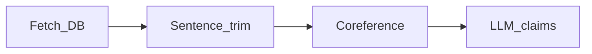

# 01 — Data cleaning pipeline (overview)

| Step | Module / command | Purpose |
|------|------------------|---------|
| Fetch | `run_term_pipeline --stage fetch` | Pull posts matching search terms from DB → `posts_for_term_raw.json` |
| Trim | `trim_sentence_boundary` | Sentence windows around hits → `posts_for_term_trimmed.json` |
| Coref | `run_term_pipeline --stage coref` | Resolve pronouns → `posts_for_term.json` (+ `.coref.jsonl` resume) |
| Claims | `python -m apps.claim_extractor.get_claims` | LLM extracts claims + scores → `posts_with_claims_full.json` |

**Framing:** long transcripts (YT/podcast) need bounded context before coref/LLM — pipeline enforces chunk size and referential clarity.
